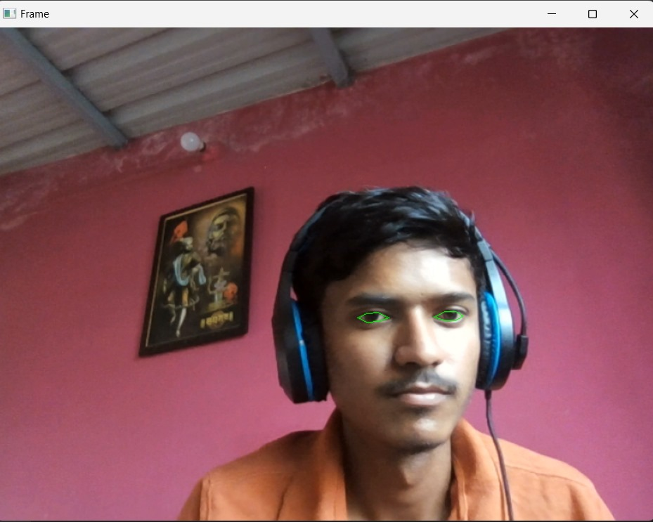
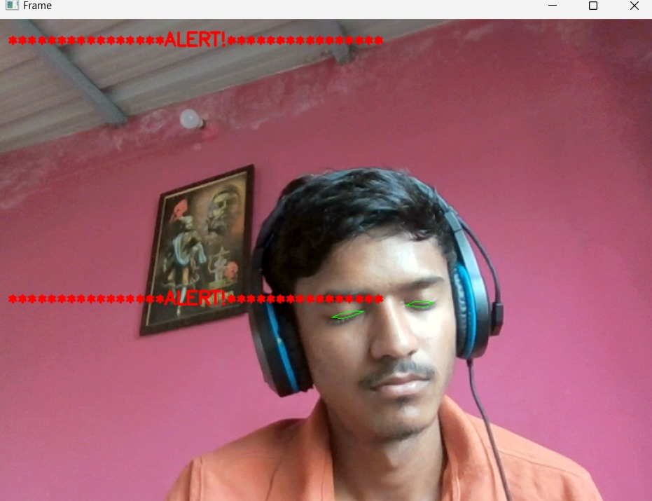

Drowsiness Detection System 😴⚠️

This project is a real-time Drowsiness Detection System built using Python and OpenCV. It uses facial landmark detection to monitor the user's eye aspect ratio (EAR) and triggers an alert when signs of drowsiness are detected. If the user's eyes remain closed for a certain duration, a warning message ("ALERT!") is displayed to prevent potential accidents. This is especially useful for drivers, students, and workers operating in critical environments.

Technologies Used
1) Python

2) OpenCV

3) Dlib (for facial landmarks)

4) imutils

Sample Output:

| Eyes Open (Normal)            | Drowsy Detected (Alert Triggered)                                      |
| ----------------------------------------------------- | ---------------------------------------------------- |
|  |  |

